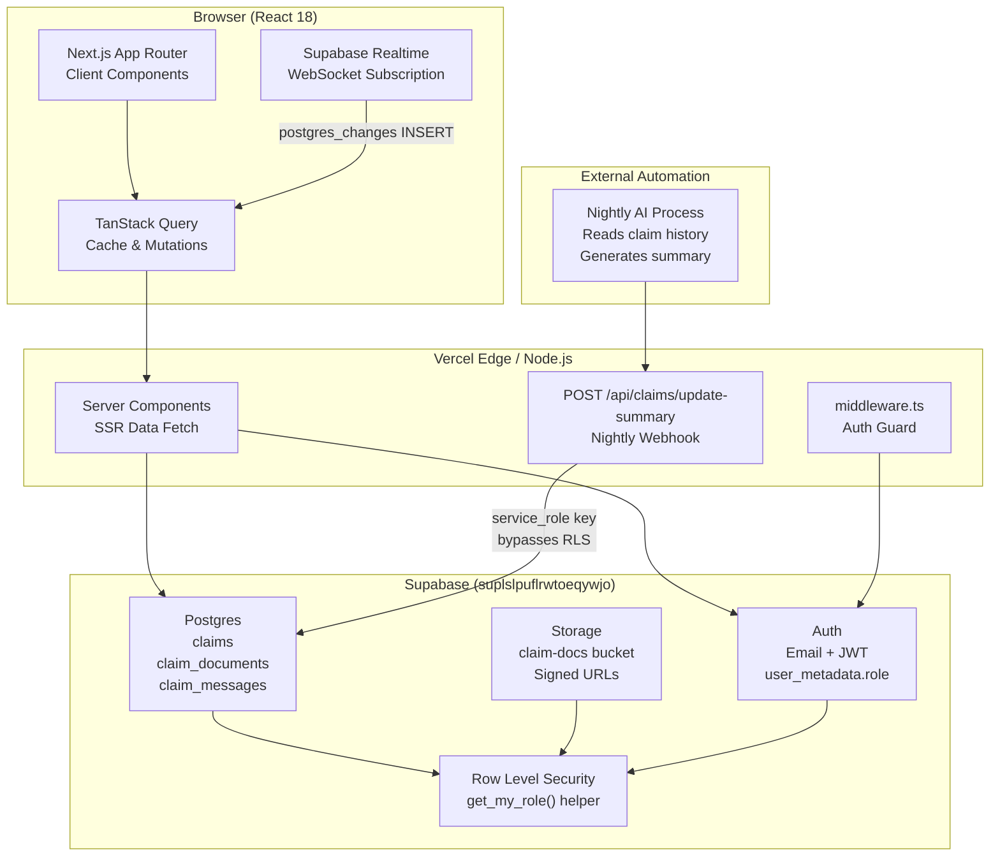
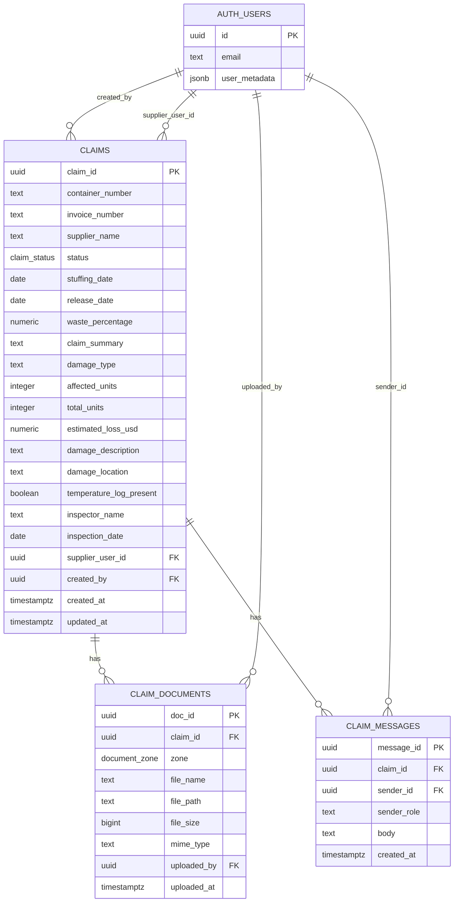

# Claimix

**Claimix** is a production-ready claims management platform for produce importers and their suppliers. It provides a structured, role-aware workspace to log, document, discuss, and resolve post-shipment damage claims — with a nightly AI summary layer built on top.

[](https://nextjs.org)
[](https://www.typescriptlang.org)
[](https://supabase.com)
[](https://tailwindcss.com)
[](https://vercel.com)

---

## Overview

When produce arrives damaged — wrong temperature, broken pallets, water ingress — someone has to manage the claim. Claimix gives importers a single place to open a claim, attach damage evidence, exchange messages with the supplier, and track resolution. Suppliers see only their own claims and can upload their QC documents directly.

---

## Architecture



---

## Database Schema



---

## Role-Based Access Control

| Feature | Importer | Supplier |
|---|:---:|:---:|
| View all claims | ✅ | ❌ |
| View assigned claims | ✅ | ✅ |
| Create new claim | ✅ | ❌ |
| Update claim status | ✅ | ❌ |
| Edit damage report | ✅ | 👁 Read-only |
| Upload: Pre-stuffing QC docs | ✅ | ✅ |
| Upload: Additional cost invoices | ✅ | ❌ |
| Upload: Supporting documents | ✅ | ❌ |
| View all documents | ✅ | ✅ (own claims) |
| Send chat messages | ✅ | ✅ |
| View AI claim summary | ✅ | ✅ |
| Access `/new-claim` | ✅ | ❌ (redirected) |

> Role is stored in Supabase `user_metadata.role` and enforced at both the RLS layer (Postgres) and the UI layer (Next.js server components + middleware).

---

## Document Upload Zones

```
┌─────────────────────────────────────────────────────────┐
│                  Claim Documents Panel                  │
├─────────────────────┬────────────────────────────────────┤
│  Zone               │  Who can upload?                   │
├─────────────────────┼────────────────────────────────────┤
│  Pre-Stuffing QC    │  Supplier ✅   Importer ✅          │
│  (Origin evidence)  │                                    │
├─────────────────────┼────────────────────────────────────┤
│  Additional Costs   │  Supplier ❌   Importer ✅          │
│  & Invoices         │                                    │
├─────────────────────┼────────────────────────────────────┤
│  Supporting Docs    │  Supplier ❌   Importer ✅          │
│  (Surveys, reports) │                                    │
└─────────────────────┴────────────────────────────────────┘
Files stored in Supabase Storage → claim-docs/{claim_id}/{zone}/{filename}
Served as time-limited signed URLs (1 hour expiry)
```

---

## Claim Detail Layout

```
┌──────────────────────────────────────────────────────────┐
│  ✦  Dynamic Claim Overview                               │
│  "Discussion ongoing re: moisture damage on 3 pallets.   │
│   Supplier uploaded QC report Mar 22. Importer awaiting  │
│   surveyor cost invoice."                 Last updated:  │
│                                           Apr 19 at 02:00│
├──────────────────────────────────────────────────────────┤
│  Claim Details                             [In Review]   │
│  ┌──────────┬───────────────┬─────────────────────────┐  │
│  │ Claim ID │ Container #   │ Invoice #               │  │
│  │ a3f8b2…  │ TCKU3456789   │ INV-2024-0892           │  │
│  ├──────────┼───────────────┼─────────────────────────┤  │
│  │ Supplier │ Stuffing Date │ Release Date            │  │
│  │ Dole     │ Mar 10, 2024  │ Mar 28, 2024            │  │
│  └──────────┴───────────────┴─────────────────────────┘  │
├──────────────────────────────────────────────────────────┤
│  Damage Report                                           │
│  Type: Temperature Damage   Units: 240 / 1200            │
│  Est. Loss: $14,400         Inspector: J. Martinez       │
│  Description: Cold chain breach detected at port…        │
├──────────────────────────────────────────────────────────┤
│  Documents   [Pre-Stuffing QC] [Add. Costs] [Supporting] │
│  📎 QC-Report-March.pdf  2.4 MB   ↗ Open preview        │
│  📎 Temperature-Log.xlsx 890 KB   ↗ Open preview        │
├──────────────────────────────────────────────────────────┤
│  Chat                                                    │
│  ┌──────────────────────────────────────────┐           │
│  │                 We need the cold chain   │           │
│  │            certificate ASAP. ──────────▶ │  Importer │
│  │                                          │           │
│  │ ◀── Attached the temperature log from   │           │
│  │      our end. See QC zone.               │  Supplier │
│  └──────────────────────────────────────────┘           │
└──────────────────────────────────────────────────────────┘
```

---

## Nightly AI Summary Webhook

An external automation process reads the full claim history nightly and POSTs a generated summary back to Claimix.

### Endpoint

```
POST /api/claims/update-summary
Authorization: Bearer {SUMMARY_API_SECRET}
Content-Type: application/json
```

### Request Body

```json
{
  "claim_id": "a3f8b2d1-0c4e-4f89-b321-7e5c9d0f1234",
  "claim_summary": "Moisture damage confirmed on 3 pallets of Dole bananas (container TCKU3456789). Supplier uploaded QC report on Mar 22 showing compliant pre-stuffing conditions. Importer awaiting surveyor cost invoice before proceeding to Resolved. Temperature log present."
}
```

### Responses

| Status | Meaning |
|---|---|
| `200 { "ok": true }` | Summary saved, `updated_at` refreshed |
| `401 Unauthorized` | Missing or invalid `SUMMARY_API_SECRET` |
| `400 Bad Request` | Missing `claim_id` or `claim_summary` |
| `404 Not Found` | No claim with that ID |
| `500 Server Error` | Supabase write failed |

### Example Call

```bash
curl -X POST https://your-app.vercel.app/api/claims/update-summary \
  -H "Authorization: Bearer $SUMMARY_API_SECRET" \
  -H "Content-Type: application/json" \
  -d '{
    "claim_id": "a3f8b2d1-0c4e-4f89-b321-7e5c9d0f1234",
    "claim_summary": "Moisture damage confirmed on 3 pallets. Supplier uploaded QC report Mar 22. Importer awaiting surveyor invoice."
  }'
```

> The route uses `SUPABASE_SERVICE_ROLE_KEY`, which bypasses RLS — appropriate only for trusted server-to-server calls.

---

## Tech Stack

| Layer | Technology |
|---|---|
| Framework | Next.js 15.5 (App Router) |
| Language | TypeScript 5 |
| Styling | Tailwind CSS v4 + OKLCH design tokens |
| Components | Radix UI primitives + shadcn-style wrappers |
| Icons | Lucide React |
| Forms | React Hook Form + Zod |
| Data Fetching | TanStack Query v5 |
| Backend / Auth | Supabase (Postgres + Auth + Storage + Realtime) |
| ORM / SDK | @supabase/supabase-js + @supabase/ssr |
| Notifications | Sonner |
| Date Formatting | date-fns |
| Deployment | Vercel (Node.js runtime) |

---

## Project Structure

```
Claimix/
├── app/
│   ├── globals.css                       # OKLCH design tokens, Tailwind theme
│   ├── layout.tsx                        # Root: QueryProvider + Toaster
│   ├── page.tsx                          # Redirect → /claims or /login
│   ├── login/page.tsx                    # Email + password sign-in
│   ├── (dashboard)/
│   │   ├── layout.tsx                    # Server auth guard + AppShell
│   │   ├── claims/
│   │   │   ├── page.tsx                  # Claims list (server fetch)
│   │   │   └── [claimId]/page.tsx        # Claim detail (server fetch)
│   │   └── new-claim/page.tsx            # Create claim (importer only)
│   └── api/claims/update-summary/
│       └── route.ts                      # Nightly AI summary webhook
├── components/
│   ├── ui/                               # 12 shadcn primitives
│   │   └── button, card, form, input, label, select,
│   │       separator, skeleton, table, textarea, checkbox, sonner
│   ├── providers/query-provider.tsx      # TanStack QueryClientProvider
│   ├── app-shell.tsx                     # Sidebar nav, role-aware links
│   ├── claims-list-page.tsx              # KPI cards + claims table
│   ├── claim-detail-page.tsx             # Detail page orchestrator
│   ├── metadata-panel.tsx                # Claim fields grid
│   ├── damage-report-form.tsx            # 9-field structured form
│   ├── claim-documents-panel.tsx         # 3-zone document panel
│   ├── document-upload-zone.tsx          # Drag-drop + file list
│   ├── chat-interface.tsx                # Threaded chat + Realtime
│   ├── claim-overview-block.tsx          # AI summary display
│   ├── claim-status-badge.tsx            # Open / In Review / Resolved
│   ├── kpi-card.tsx                      # KPI metric card
│   └── new-claim-form.tsx                # Claim creation form
├── lib/
│   ├── supabase/
│   │   ├── client.ts                     # Browser Supabase client
│   │   └── server.ts                     # Server Supabase client (SSR)
│   ├── auth.ts                           # getUserRole, requireRole helpers
│   ├── types.ts                          # Claim, ClaimDocument, ClaimMessage, UserRole
│   ├── utils.ts                          # cn() utility
│   ├── mock-data.ts                      # DEMO_MODE seed data
│   └── queries/
│       ├── claims.ts                     # CRUD + updateClaimSummary
│       ├── documents.ts                  # Storage upload + fetch
│       └── messages.ts                   # sendMessage + fetchMessages
├── hooks/
│   ├── use-role.ts                       # useRole, useCurrentUser
│   ├── use-claims.ts                     # useQuery: claims list
│   ├── use-claim.ts                      # useQuery: single claim
│   └── use-messages.ts                   # useQuery + Realtime subscription
└── middleware.ts                         # Edge auth guard
```

---

## Getting Started

### 1. Clone

```bash
git clone https://github.com/ItaiRahamim/Claimix.git
cd Claimix
npm install
```

### 2. Configure Environment

Create `.env.local`:

```env
NEXT_PUBLIC_SUPABASE_URL=https://<project-ref>.supabase.co
NEXT_PUBLIC_SUPABASE_ANON_KEY=<anon-key>
SUPABASE_SERVICE_ROLE_KEY=<service-role-key>
SUMMARY_API_SECRET=<long-random-secret>

# Optional: set to "true" to bypass auth entirely for local UI work
NEXT_PUBLIC_DEMO_MODE=false
```

| Variable | Where to find it |
|---|---|
| `NEXT_PUBLIC_SUPABASE_URL` | Supabase Dashboard → Project Settings → API |
| `NEXT_PUBLIC_SUPABASE_ANON_KEY` | Supabase Dashboard → Project Settings → API |
| `SUPABASE_SERVICE_ROLE_KEY` | Supabase Dashboard → Project Settings → API (secret) |
| `SUMMARY_API_SECRET` | Generate: `openssl rand -hex 32` |

### 3. Run the Database Schema

Open your Supabase project's **SQL Editor** and run the schema from the plan (creates `claims`, `claim_documents`, `claim_messages` tables with RLS policies and triggers).

### 4. Create Users

In Supabase Dashboard → Authentication → Users → **Add user**:

```
Email: importer@example.com  Password: ••••••
user_metadata: { "role": "importer" }

Email: supplier@dole.com     Password: ••••••
user_metadata: { "role": "supplier" }
```

Set `supplier_user_id` on any claims you want the supplier to see.

### 5. Run Dev Server

```bash
npm run dev
```

Open [http://localhost:3000](http://localhost:3000)

---

## Deployment (Vercel)

1. Push to GitHub: `git push origin main`
2. Import the repo at [vercel.com/new](https://vercel.com/new)
3. Add the four environment variables from `.env.local`
4. Deploy — Vercel auto-detects Next.js and uses the Node.js runtime

> **Important:** Do **not** add `export const runtime = 'edge'` to server files. Supabase SSR (`@supabase/ssr`) requires the Node.js runtime and is not compatible with Cloudflare's V8 edge runtime.

---

## Key Engineering Decisions

### `getSession()` over `getUser()` on the client

`supabase.auth.getUser()` makes a network request and acquires a mutex lock. Under React StrictMode's double-invoke (or fast navigation), concurrent calls cause a `"Lock was not released within 5000ms"` error that freezes the UI. `getSession()` reads from `localStorage` — instant and lock-free.

### Direct imports in `"use client"` files

Early code used `import("@/lib/supabase/client")` inside `useEffect`. The cleanup function ran synchronously before the dynamic import resolved, so `channel` was always `undefined` and subscriptions leaked. Switching to a top-level `import` (safe in client-only files) fixed the leak.

### `date-fns format(parseISO())` for all dates

`toLocaleDateString()` produces different strings on Node.js (server, UTC) vs the browser (user timezone) → React Hydration Error #418. A fixed `date-fns` format string is deterministic regardless of environment.

---

## Roadmap

- [ ] Email notifications when a message is received
- [ ] Claim export to PDF
- [ ] Bulk claim import from CSV
- [ ] Supplier invite flow (auto-create supplier account and link to claim)
- [ ] Claim analytics dashboard (loss by supplier, container, season)
- [ ] Mobile-responsive layout improvements
- [ ] Audit log (who changed what, when)
